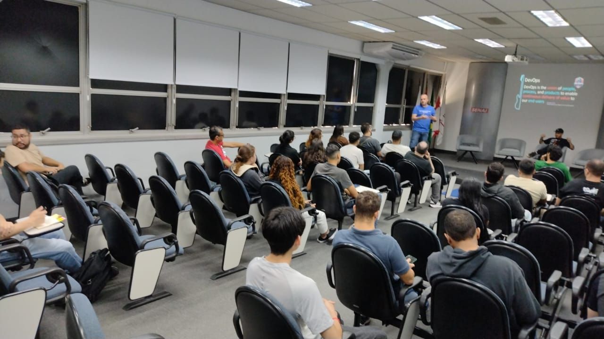
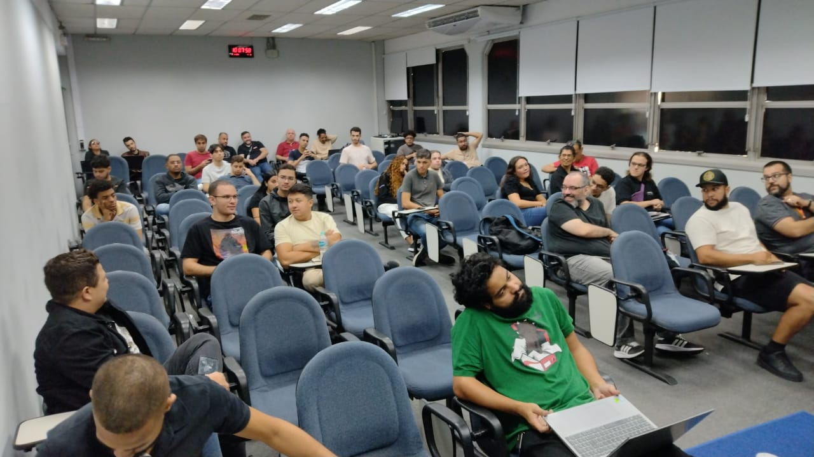

# Global DevOps Experience 2024 - São Paulo-SP
Fotos e informações gerais sobre o evento "Global DevOps Experience", realizado em 15/06/2024 na cidade de São Paulo-SP.

Organizadores:
- **Vinicius Moura (Microsoft MVP)**
- **Milton Camara Gomes (Microsoft MVP, MTAC)**
- **Renato Groffe (Microsoft MVP, MTAC)**
- **Atila Olivi (SENAI)**

Palestrantes:
- **Vinicius Moura (Microsoft MVP)**
- **Milton Camara Gomes (Microsoft MVP, MTAC)**
- **Renato Groffe (Microsoft MVP, MTAC)**

Número de participantes: **37 pessoas**

Tecnologias abordadas: **GitHub, GitHub Actions, Azure DevOps, Azure Pipelines, Git, Visual Studio Code, Terraform, ARM Templates, Bicep, Docker, Kubernetes, Trivy, OWASP, OWASP Dependency Check, Checkmarx, Veracode, Azure App Service, Linux, macOS, Windows...**

Acesse este [**link**](/img/) para visualizar todas as fotos das apresentações.

Este evento foi uma parceria entre a comunidade [**Azure na Prática**](https://www.youtube.com/azurenapratica) e a [**Escola Senai Suíço-Brasileira Paulo Ernesto Tolle**](https://suicobrasileira.sp.senai.br/).

Formulário utilizado para inscrições: [**Sympla**](https://www.sympla.com.br/evento/global-devops-experience-2024-devops-github-copilot-nuvem-gratuito-e-presencial-sao-paulo-sp/2506336)

Local: Escola SENAI Suíço-Brasileira Paulo Ernesto Tolle - Rua Bento Branco de Andrade Filho, 379 - Santo Amaro - São Paulo/SP - CEP 04757-000

